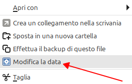
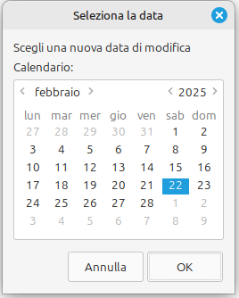
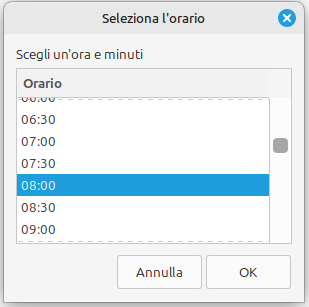
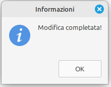

# Nemo-Action-Change-files-modification-date

(qui trovate [la traduzione in italiano](#italian) del seguente testo)

## Nemo-Action: Changing the Modification Date of Selected Files

Hello everyone, this is my first project on **GitHub**... I spent an entire night on it! Mostly to create the .sh code, and partly just to understand how GitHub works xD.

### What Is It About?

This is an **Action** for the file manager **[Nemo](https://https://github.com/linuxmint/nemo)**, a free and open-source software and the official file manager of the **Cinnamon desktop environment**, to change with a right-click **the modification date of one or more files** selected with the mouse. I also wanted to be able to change the creation date, but after a hundred failed attempts, I gave up. I would be infinitely grateful if someone could help me with that!

The Action is **multilingual**, currently only in 🇮🇹 **Italian**, 🇩🇪 **German**, 🇬🇧 **English**, 🇫🇷 **French**, 🇪🇸 **Spanish** and 🇵🇹 **Portuguese**.

If someone could **test it** in these languages, I would be very happy. Also, **if someone suggests other languages**, I will implement them in the action.

### Which Files Make Up the Action?

This Action is composed of two files:

* the file `Change-files-modification-date.nemo_action` which is the file read by Nemo to execute the Action and which contains the instructions to load the second file (as well as setting the name and the icon that will be displayed when you right-click an icon, and other little things – I’ll talk about it later);
* the file `Change-files-modification-date.sh` which contains the actual bash script that will help you modify the date of the files you have selected.

### Action Dependencies

To run the script correctly, a few dependencies are required:

* `zenity` - For dialog windows.  
  If you haven’t installed it yet you can do so with: `sudo apt install zenity`;
* `coreutils` - Contains touch to modify the date.  
  If you haven’t installed it yet you can do so with: `sudo apt install coreutils`

### Procedure:

These two files, for the Action to work, must be placed **<ins>both</ins>** in the folder `.local/share/nemo/actions` (as with all Nemo actions).  
Then you need to open this folder in your terminal – usually, when you are in that folder in Nemo, right-clicking on an empty area and choosing `Apri nel terminale`, or by opening the terminal (CTRL+ALT+T) and issuing the command `cd $HOME/.local/share/nemo/actions` – and make the file `Change-files-modification-date.sh` executable by issuing the command `chmod +x Change-files-modification-date.sh`.

Once this is done, you need to:

1. **Close Nemo**: either by closing it normally from the window of our beloved file manager (making sure you have closed any other open Nemo windows), or from the Terminal by issuing the command `nemo -q`.
2. **Reopen Nemo**: either in the usual way (I won’t explain how, I’m sure you know it well!), or by issuing the command `nemo` in your Terminal.

### Ready, Set, GO!

From now on, when you select one or more files in Nemo, by right-clicking on them, you will see a new menu item: `Modifica la data`.

Clicking on it will start the actual process contained in the `.sh` file to change the modification date of the selected file(s).

At first, you will be asked whether or not to create a **backup** of the files that will be modified (the backup will have the extension `.bkp`) and whether to create a **Debug**. Both, if chosen, will be created in the same folder where the files you chose to modify are located.

Then a calendar dialog window (`zenity --calendar`) will open where you can select the new date, as you wish. You can change the day, the month, and the year directly from there.

Once you click OK, a new dialog window will appear – a dropdown menu – in which you can select the time; for convenience, it is set in 30-minute increments (00:00 - 23:30).

Click OK here as well and the final confirmation window will appear...

...and the modification date of the selected file(s) will be, like magic, changed.

Easy, right?

---

I’ll stop here for now; I’m literally exhausted and in just over an hour I have an appointment (and I haven’t slept… AT ALL!!!).

Soon I’ll explain (maybe) on this page exactly what the two files do.

Best regards and all the best to everyone,

@FranzBias (Francesco)

## 📄 License

MIT – do whatever you want, just don't remove my name 😉

## ✍️ Author

Made with ❤️ by Franz Bias (Francesco Bianchi)  
[https://www.bybias.com](https://www.bybias.com)

---

Traduzione in italiano (Italian translation):

# Nemo-Action-Change-files-modification-date

## Nemo-Action: Cambiare la data di modifica dei file selezionati

Salve a tutti, questo è il mio primo progetto su **GitHub**... ci ho messo tutta una nottata! In grossa parte per creare il codice .sh, in parte anche per capire solamente come funziona GitHub xD.

### Di che cosa si tratta?

Questa è una **Action** per il file manager **[Nemo](https://https://github.com/linuxmint/nemo)**, software libero e open-source e file manager ufficiale dell'**ambiente desktop Cinnamon**, per modificare con un click destro **la data di modifica di uno o più file** selezionati con il mouse. Avrei voluto anche fare in modo di poter modificare la data di creazione, ma dopo un centinaio di tentativi andati male ci ho rinunciato. Se qualcuno mi potesse aiutare in questo gliene sarei infinitamente grato!

La Action è **multilingua**, per adesso solamente in 🇮🇹 **Italiano**, 🇩🇪 **Tedesco**, 🇬🇧 **Inglese**, 🇫🇷 **Francese**, 🇪🇸 **Spagnolo** e 🇵🇹 **Portoghese**.

Se qualcuno **potesse testarlo** in queste lingue mi farebbe un grosso piacere. Inoltre, **se qualcuno mi suggerirà altre lingue**, le implementerò nella action.

### Quali file compongono la Action?

Questa Action è composta da due file:

* il file `Change-files-modification-date.nemo_action` che è il file letto da Nemo per eseguire la Action e che contiene le istruzioni per leggere il secondo file (oltre a impostare il nome e l'icona che saranno visualizzati quando si fa click con il tasto destro una icona, e altre cosette varie - ne parlerò più avanti);
* il file `Change-files-modification-date.sh` che contiene il bash vero e proprio che provvederà ad aiutarvi nella modifica della data dei file che avete selezionato.

### Dipendenze della Action

Per far funzionare correttamente lo script, servono alcune dipendenze:

* `zenity` - Per le finestre di dialogo.
  Se non l'avete già installato si può fare con: `sudo apt install zenity`;
* `coreutils` - Contiene touch per modificare la data.
  Se non l'avete già installato si può fare con: `sudo apt install coreutils`

### Procedimento:

Questi due file, per far si che la Action possa funzionare, devono essere messi **<ins>entrambi</ins>** nella cartella `.local/share/nemo/actions` (come per tutte le action di Nemo).
Dopodiché dovrete aprire questa cartella nel vostro terminale -solitamente, quando in Nemo vi trovate in tale cartella, facendo click in una parte vuota di essa con il tasto destro e scegliendo `Apri nel terminale`, oppure aprendo il terminale (CTRL+ALT+T) e inviando il comando `cd $HOME/.local/share/nemo/actions`- e rendete eseguibile il file `Change-files-modification-date.sh` inviando il comando `chmod +x Change-files-modification-date.sh`.

Una volta che si è fatto questo, bisogna:

1. **Chiudere Nemo**: o come si fa normalmente dalla finestra del nostro amato file manager (facendo attenzione di aver chiuso tutte le eventuali altre finestre aperte di Nemo), oppure da Terminale inviando il comando`nemo -q`.
2. **Riaprire Nemo**: o come si fa normalmente (non vi scrivo come, credo lo sappiate molto bene!), oppure inviando il comando `nemo` nel vostro Terminale.

### Pronti, partenza, VIA!

Da adesso in poi, quando selezionerete uno o più file in Nemo, cliccando con il tasto destro su di essi, vedrete nel menù una nuova voce: `Modifica la data`.

Cliccandoci sopra partirà il processo vero e proprio contenuto nel file `.sh` per cambiare la data di modifica del file o dei file selezionati.

All'inizio vi verrà chiesto se creare o meno un **backup** dei file che verranno modificati (il backup avrà l'estensione `.bkp`) e se creare un **Debug**. Entrambi, nel caso, verranno creati nella stessa cartella dove i file che avete scelto di modificare si trovano,

Quindi si aprirà una finestra di dialogo di tipo calendario (`zenity --calendar`) dove potrete selezionare la nuova data, a vostro piacimento. Potete cambiare il giorno, il mese e l'anno direttamente da qui.

Una volta dato l'OK, comparirà una nuova finestra di dialogo, un menu a tendina, nella quale potrete selezionare l'orario - per comodità è con incrementi di 30 minuti (00:00 - 23:30).

Date l'OK anche qui e vi comparirà l'ultima finestra di conferma...

...e la data di modifica del (o dei) file da voi selezionato sarà, come per magia, cambiata.

Facile vero?

---

Per adesso la finisco qui, sono letteralmente distrutto e tra poco più di un'ora devo essere ad un appuntamento (ed ho dormito... NIENTE!!!).

Prossimamente (forse) spiegherò su questa pagina cosa fanno esattamente i due file.

Un saluto e tante buone cose a tutti,

@FranzBias (Francesco)

## 📄 Licenza

MIT - fate quello che volete, basta che non rimuoviate il mio nome 😉

## ✍️ Autore

Realizzato con ❤️ da Franz Bias (Francesco Bianchi)  
[https://www.bybias.com](https://www.bybias.com)
---
